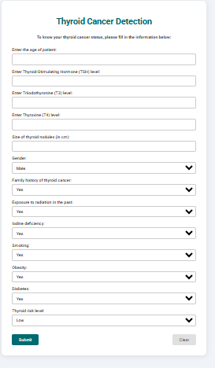
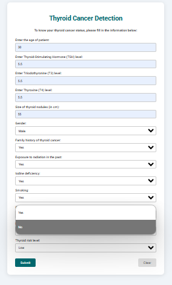
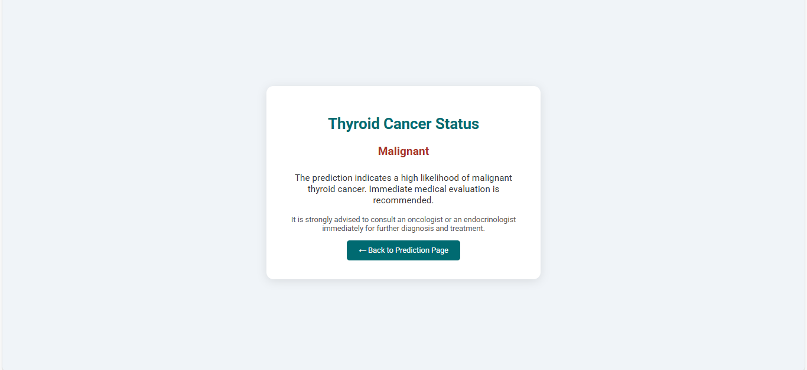
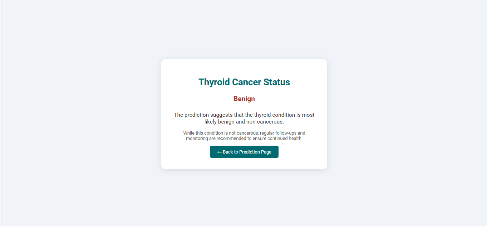

# 🧠 Thyroid Cancer Detection – Machine Learning Project

This Machine Learning project focuses on predicting whether a thyroid condition is Benign or Malignant using various medical and lifestyle inputs. The model is trained on relevant clinical data and leverages classification techniques to assist in early diagnosis and risk assessment. This project demonstrates the application of machine learning in the healthcare domain, aiming to support medical professionals with data-driven insights.


This project demonstrates the complete ML pipeline:

✅ Data preprocessing  
✅ Model building  
✅ Evaluation  
✅ Web app deployment using Flask  

---

## 📌 Objectives

- Analyze and preprocess thyroid cancer data  
- Train a Logistic Regression model  
- Evaluate model performance  
- Build a Flask web app for real-time predictions  

---

## 🧠 Features Used for Prediction

| Feature     | Description |
|-------------|-------------|
| `age`       | Age of the patient |
| `tsh`, `t3`, `t4` | Thyroid hormone levels |
| `nodulesize` | Size of thyroid nodules (in cm) |
| `gender`    | Male or Female |
| `fhistory`  | Family history of thyroid cancer (Yes/No) |
| `rexposer`  | Past exposure to radiation (Yes/No) |
| `iodind`    | Iodine deficiency (Yes/No) |
| `smoking`   | Whether the person smokes |
| `obesity`   | Whether the person is obese |
| `diabetes`  | Diabetes status |
| `rlevel`    | Risk level: Low / Medium / High |

---

## 📒 Jupyter Notebook Highlights

The Jupyter Notebook (`Thyroid Cancer Prediction.ipynb`) contains:

- ✅ Data exploration and summary statistics  
- ✅ Missing value handling  
- ✅ Feature encoding  
- ✅ Model training with Logistic Regression  
- ✅ Model evaluation  
- ✅ Model saving with pickle  

---

## 🌐 Web App Overview

Built using Flask, the app provides a clean UI where users can input patient data and get a prediction result.

- `thyroid_model.py` – Main Flask application  
- `templates/home.html` – Form for data entry  
- `templates/prediction.html` – Displays prediction results  

---

## 🖼 Screenshots

### 🧾 Input Form Page
This is where users enter medical and personal details for prediction.



---

### 🔍 Prediction Result Page
Displays whether the condition is predicted as **Benign** or **Malignant**, with an explanation and medical advice.



---

## 🏃‍♂️ How to Run This Project

### 1. Clone the Repository

```bash
git clone https://github.com/your-username/thyroid-cancer-detection.git
cd thyroid-cancer-detection
```

### 2. Install Dependencies

```bash
pip install -r requirements.txt
```

### 3. Run the Flask App

```bash
python thyroid_model.py
```

### 4. Open in Your Browser

```cpp
http://127.0.0.1:5000/
```

## 🛠 Tools & Technologies Used

### 📚 Languages & Libraries
_Python

_Pandas, NumPy

_scikit-learn

_Flask

_Pickle

### 💻 Development & Visualization
_Jupyter Notebook

_HTML/CSS (Frontend)

_Google Fonts

### 🔍 Model
_Logistic Regression (with preprocessing and encoding)

### 📦 Deployment Ready
_Flask Web App

_requirements.txt for environment setup

## 👤 Author

**IqraIzhar**
- **LinkedIn:** [linkedin.com/in/iqra-izhar-08b8b8330](https://www.linkedin.com/in/iqra-izhar-08b8b8330)  
- **GitHub:** [github.com/iqraizhar72](https://github.com/iqraizhar72)
- **Email:** [iqraizhar72@gmail.com](mailto:iqraizhar72@gmail.com)
